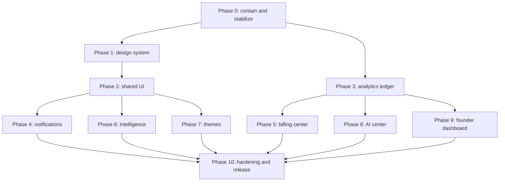

# Portfolio Hub — Phased Implementation Plan

**Prepared:** 2026-07-13  
**Input:** `PROJECT_AUDIT.md` and the requested ten-phase product brief  
**Rule:** Complete and verify one phase before beginning the next; preserve public URLs and data contracts through explicit adapters

## Outcome

This plan adds a prerequisite **Phase 0** for privacy and operational stabilization, then follows the requested phases: global design, shared UI, analytics, notifications, billing, portfolio intelligence, themes, AI center, founder dashboard, and final hardening. It is designed for incremental delivery—no full rewrite and no “big bang” migration.

Phase 0 is mandatory because the audit found a critical public billing-proof path and several high-risk foundations. Product work may be designed in parallel on paper, but it should not be merged onto a foundation that can expose private files, skip migrations, or produce false revenue totals.

## Implementation status

**Phase 0A source implementation completed on 2026-07-14.** The updated package separates public payment QR codes from private customer proofs, adds authenticated superadmin retrieval, blocks legacy public proof paths, supports authenticated Cloudinary/local private storage, provides a resumable migration command, excludes proof assets from source/container artifacts, and adds focused regression tests. Live storage migration, cache/history purge, incident review, and production verification remain deployment-owner actions; they were not run against a live environment during source implementation.

**Phase 0B source implementation completed on 2026-07-14.** Production ORM bootstrap/stamp fallbacks are disabled; Render, Docker, and Compose now run a locked `db-upgrade-all` path; the 63-revision core graph remains a single connected history with guarded legacy conflicts; tenant models have an independent additive Alembic baseline and `alembic_version_tenant`; startup tenant validation is read-only; and focused topology, deployment, and tenant model-contract tests pass. Live PostgreSQL rehearsals against an empty database, the oldest supported backup, a current production clone, and an interrupted clone remain a mandatory deployment-owner release gate because no database service or Flask/Alembic runtime was available in the implementation workspace.

**Phase 0C source implementation completed on 2026-07-14.** Canonical host-aware public URL contracts now cover platform, tenant path, tenant subdomain, and verified custom-domain portfolio/project/contact surfaces; legacy GET/POST routes remain adapters; `/livez` and migration-aware `/readyz` are split and deployment probes use readiness; signups create an empty portfolio plus durable workflow checklist instead of sample facts; unproven landing claims are removed; Developer Pro is CSP-local and real-data-only; and a production support matrix plus focused regression guards are included. Live Flask/PostgreSQL/Redis route, dependency-failure, provider, and browser/CSP evidence remains a mandatory deployment-owner gate because those runtimes were unavailable in the implementation workspace.

**Phase 1 source implementation completed on 2026-07-14.** The platform now has one documented semantic token and typography API, self-hosted/version-pinned Syne, DM Sans, and JetBrains Mono assets, a validated external pre-paint theme bootstrap, a compatibility/deprecation registry, cross-theme accessibility behavior, a superadmin-only synthetic component reference, and token-lint/source regression coverage. All platform shells load the design system once and platform templates no longer contact Google Fonts. Browser visual snapshots, automated contrast/axe, forced-colors, 200% zoom, WOFF2/CSP network checks, and supported-browser theme persistence remain mandatory deployment-owner release gates because no browser/deployable Flask runtime was available in the implementation workspace.

**Phase 2 source implementation completed on 2026-07-14.** A stable Jinja macro API now covers the requested action, input, feedback, container, overlay, navigation, and data-display families; token-only CSS and an external controller provide focus lifecycle, keyboard, loading/error, mobile, dark-mode, and safe DOM behavior. Platform bases load the contract once; admin/superadmin flash and confirmation surfaces, tenant notification polling, 2FA verification, and OAuth setup feedback/theme bootstrap are migrated pilots; a protected synthetic component gallery and a deletion-gated legacy registry are included. Ten source checks and four jsdom behavior/security tests pass. Flask/Jinja malicious-string rendering, axe/CSP, visual characterization, computed touch targets, screen-reader, 200% zoom, and supported-browser tests remain deployment-owner gates.

**Phase 3 source implementation completed on 2026-07-14.** Versioned `finance-v1.0.0` definitions now drive an append-only Dodo/PayMongo/manual ledger with original minor-unit currency, reproducible fixed-scale USD, provider/environment idempotency, linked corrections, tamper-resistant audit events, review-required handling, provider-time state ordering, and a provenance-first backfill. Verified provider and manual approval paths append through one persistence boundary; live-mode SQL aggregation supplies Platform Overview and Subscription Monitor with cash, MRR/ARR, provider, trend, freshness, and source-coverage data, while legacy plan-price/payment-float display calculations are disabled. Fourteen Phase 3 tests, 32 prior source regressions, and four DOM tests pass. PostgreSQL migration/replay races, real signed provider captures, Redis behavior, production-scale query budgets, live reconciliation, and browser rendering remain deployment-owner release gates documented in the backfill runbook.

**Phase 4 source implementation completed on 2026-07-14.** Recipient-scoped notifications, per-user receipts, and a durable in-app/email delivery outbox now replace active `SubscriptionNotification` writers behind one authorization, rendering, dedupe, cursor, ETag, retention, and retry service. Migration `0058` preserves legacy content, shared read state, and prior email evidence. Tenant-admin and superadmin share one safe bell/dropdown contract and separate server-authorized full feeds. Real project-like, portfolio milestone, inquiry, bidirectional messaging, manual review, verified provider failure/lifecycle, and renewal/reminder/expiry producers publish named-route actions without arbitrary HTML or URLs; no AI or health activity is invented before real owning sources exist. Eight Phase 4 source tests, three notification DOM tests, prior phase regressions, migration checks, and compilation pass. PostgreSQL backfill/race/query-plan, multi-worker outbox, MailerSend, Flask/Jinja authorization, accessibility, and supported-browser evidence remain deployment-owner gates in `NOTIFICATION_SYSTEM.md`.

**Phase 5 source implementation completed on 2026-07-14.** Migration `0059` expands billing with exact minor-unit dual writes, backup-first float conversion, sold-plan catalog snapshots, invoice line/status evidence, explicit subscription lifecycle events, idempotent retry attempts, and database/ORM immutability guards. Dodo, PayMongo, and manual remain separate with original currency and provider provenance. Coupon redemption and manual review use database locking/uniqueness; review decisions require reasons. Ledger-backed tenant/superadmin Billing Centers now expose trusted revenue definitions, subscriptions, transactions, invoices, manual submissions, coupons, retries, refunds, and reconciliation, with tenant-scoped server-generated PDF receipts and masked external references. Fourteen Phase 5 tests, 54 prior phase source/domain checks, seven DOM tests, token lint, compilation, JavaScript syntax, and Poppler PDF rendering pass. PostgreSQL migration/backfill/races/triggers, provider sandbox contracts, Flask authorization/rendering, reconciliation, query plans/load, accessibility, and browser evidence remain deployment-owner gates in `BILLING_CENTER.md`.

**Phase 6 source implementation completed on 2026-07-14.** One deterministic `portfolio-intelligence-2026.07-v1` service now calculates explainable profile, project, service, testimonial, certificate, experience, SEO, accessibility-field, contact, and freshness dimensions from tenant-scoped stored facts. Unsupported rendered evidence is explicitly not evaluated. Relevant writes recalculate through one post-commit hook; content/freshness hashes and rubric versions select concurrency-safe append-only snapshots created only after launch. The authenticated workspace exposes definition/version/time, evaluated coverage, exact editor links, honest SEO and accessibility evidence, and prioritized actions. The SEO editor and completion notifications delegate to the canonical service instead of maintaining competing calculations. Sixteen Phase 6 tests pass across empty/partial/complete fixtures and all five themes, including monotonic, deletion, freshness, determinism, evidence, route, tenant, history, and styling contracts. PostgreSQL, Flask authorization/rendering, multi-worker race, browser, accessibility, and Phase 7 rendered-theme evidence remain deployment-owner gates in `PORTFOLIO_INTELLIGENCE.md`.

**Phase 7 source implementation completed on 2026-07-15.** The curated five-theme registry now enforces versioned manifests, complete section declarations, self-hosted assets, CSP restrictions, provenance-labeled design fixtures, and typed customization tokens at startup. Anonymous previews cannot deliver contact submissions or masquerade as customer portfolios. Tenant theme selection remains plan-gated and atomically verified; selection counters record actual changes only and unsupported popularity/trending claims are withheld. Migration `0061` adds tenant-scoped private drafts and append-only publish/rollback history with concurrency-safe version allocation. The admin installed marketplace provides search, categories, preview, select, and plan-aware customization. Seventeen Phase 7 contracts pass all five themes across empty/minimal/full/hostile/long content; 95 Python contracts, four DOM tests, five manifest validations, seven CSS token checks, Python compilation, and JavaScript syntax all pass. PostgreSQL migration/trigger races, full Flask authorization/rendering, real contact delivery, CSP/browser matrices, responsive visual review, and performance budgets remain deployment-owner gates in `THEME_MARKETPLACE.md`.

**Phase 8 source implementation completed on 2026-07-15.** One provider-neutral `AIService` now owns tenant/plan policy, model capability selection, immutable prompt versions, exact microunit budget reservations, encrypted idempotent jobs, provider execution, conservative retries, append-only usage/pricing evidence, redacted audit, and payload retention. The seven-provider registry maps to recorded-fixture adapters for OpenAI Responses, OpenAI-compatible chat, Anthropic Messages, and Gemini `generateContent`; endpoint allowlists prevent arbitrary provider URLs. Migration `0062` is additive and contains no fake configuration or usage. The Superadmin AI Center exposes masked provider/API-key configuration, evidence-based health, model/pricing allowlists, tenant/global features and budgets, prompt publish/activation, usage/cost/latency/errors, job/audit logs, and a billing-acknowledged live test console. Knowledge Base remains explicitly unavailable until a real isolated ingestion lifecycle exists. Twenty-one Phase 8 contracts, 100 prior/current unittest contracts, sixteen Phase 6 functions, seven DOM/security tests, eight CSS token checks, Python compilation, and AST scans pass. PostgreSQL migration/race/reconciliation, full Flask/Jinja/CSRF authorization, real budget-capped provider tests, Redis workers, retention, accessibility, CSP, and browser evidence remain deployment-owner gates in `AI_CENTER.md`.

**Phase 9 source implementation completed on 2026-07-15.** The legacy route-local Superadmin overview is replaced by one `founder-dashboard-2026.07-v1` assembler composing versioned lifecycle, ledger, portfolio, AI, and operations read models. Allowlisted UTC ranges, previous-interval comparison, current-plan/payment-provider/AI-provider filters, source freshness, watermark cache invalidation, assembly timing, and index-only core/tenant migrations support bounded reads. Conversion, churn, completion, project/service engagement, AI cost, and CPU/RAM/disk remain unavailable whenever privacy, lifecycle, event, usage, or monitoring evidence is insufficient. The restricted dashboard links to owning operational centers and exposes no mutation endpoints. Aggregate-only CSV export requires an explicit capability, CSRF POST, current password, fresh TOTP, ten-minute session binding, and durable audit. Fifteen Phase 9 contracts, 115 unittest contracts, sixteen Phase 6 functions, seven DOM/security tests, nine CSS token checks, compilation, AST, and both migration topology checks pass. PostgreSQL reconciliation/query plans/load, Flask/Jinja authorization and render tests, Redis multi-worker invalidation, export negative tests, accessibility, CSP, and browser evidence remain deployment-owner gates in `FOUNDER_DASHBOARD.md`.

**Phase 10 source hardening checkpoint completed on 2026-07-15; production release remains on hold.** Trusted proxy handling is explicit and fail-safe by default; application abuse controls no longer consume raw forwarding headers; correlation/query telemetry is privacy-safe; sensitive proofs cross a quarantine/malware seam; global script/style blocks are nonce-protected; insecure Compose database defaults are removed; and deterministic source, SBOM, theme, token, Python, and JavaScript gates pass. Scoped legacy CSP attribute compatibility remains for 67 handler and 660 style attributes, with 62 HTML-rendering sinks inventoried. The exact pinned application image, PostgreSQL/Redis integration, browser/accessibility/performance matrices, malware engine, backup/PITR, rolling rollback, container/dependency/SAST scans, and authorized staging penetration test were unavailable here and are mandatory before release. See `PHASE_10_RELEASE_HARDENING.md` and `SECURITY_OPERATIONS_RUNBOOK.md`.

## Program invariants

These rules apply to every phase:

1. **No fake data.** Empty states must be honest. Do not persist sample projects, testimonials, certificates, transactions, analytics, AI usage, or system metrics.
2. **One owner per concept.** Each domain has one service/API and one set of definitions. Compatibility modules may delegate but must not independently calculate.
3. **Immutable financial facts.** Provider events and posted transactions are append-only; corrections use reversals or adjustments.
4. **Preserve original currency.** Store original minor-unit amount/currency and a reproducible USD reporting conversion.
5. **Version every schema change.** No production `create_all()`, startup DDL, or silent stamping.
6. **Tenant isolation by construction.** Tenant scope and role checks live at controller and query boundaries, with negative tests.
7. **Accessible and responsive by default.** WCAG 2.2 AA, keyboard support, reduced motion, visible focus, and mobile behavior are component acceptance criteria.
8. **No inline implementation.** New behavior and styling belong in versioned JS/CSS modules; no new inline scripts, styles, or event handlers.
9. **No silent fallback.** Provider, cache, email, payment, AI, and database failures are explicit and observable; unsupported data is shown as unavailable, not zero.
10. **Backward compatibility is tested.** Existing URLs, endpoints, imports, webhook contracts, themes, and stored data remain supported until a documented deprecation completes.
11. **Every phase is independently releasable.** Use feature flags, expand/migrate/contract database changes, rollback instructions, and phase-specific test evidence.

## Delivery flow

The numbered phases remain the merge order. The diagram shows architectural dependencies that should influence design and test preparation.

## Phase 0 — Privacy containment and stable foundations

### Objective

Remove release blockers, establish trusted deployment behavior, and capture characterization tests before visible redesign work.

### 0A. Contain billing proofs

- Inventory every billing-proof database reference and storage object without copying proof content into logs or tickets.
- Disable anonymous access to the `billing` upload class immediately.
- Add a private storage adapter with opaque keys, encryption, bounded content types/size, retention, and delete support.
- Add a superadmin-only download controller or short-lived signed URL flow. Authorize on every request; do not rely on obscurity.
- Migrate referenced files using a resumable, checksummed job. Record source object, destination object, status, timestamps, and error without recording sensitive content.
- Quarantine or remove unreferenced files only after a retention decision and backup review.
- Purge proofs from source history, archives, build cache, container images, deployment disks, and CDN caches where applicable.
- Run an exposure/incident assessment and document owner, timeline, affected environments, and notification decision.

**Tests:** anonymous/member/tenant-admin/wrong-tenant requests receive 404 or 403; authorized superadmin succeeds; expired links fail; path traversal and content-type attacks fail; audit event is emitted; deleted/expired objects are unrecoverable through public routes.

### 0B. Make schemas deterministic

- Disable `USE_ORM_BOOTSTRAP_ON_STARTUP` and migration-failure fallback in production configuration.
- Repair/rehearse the 63-revision core Alembic chain against: empty DB, oldest supported backup, current production clone, and partially failed clone.
- Create a real tenant-bind migration environment with its own version table and initial baseline verified against current models.
- Convert startup `create_all()`/direct DDL repairs into versioned migrations. Startup may report drift but must not mutate schema.
- Add a deployment pre-step that acquires a migration lock, applies core then tenant migrations, validates heads, and aborts on failure before web rollout.
- Document backup, restore, downgrade/forward-fix, and rollback boundaries. Destructive conversions need pre-migration backups and row-count/checksum validation.

**Tests:** clean upgrade; upgrade from supported snapshots; idempotent re-run; expected constraints/indexes; core/tenant head checks; failure leaves the old app serving; no web-worker startup DDL.

### 0C. Fix routing, readiness, and false content

- Define the canonical contract for platform contact, tenant contact, project detail, subdomain, and custom domain URLs.
- Consolidate duplicate handlers behind one service per concern; retain old paths only as tested redirects/adapters.
- Split `/livez` and `/readyz`; configure Render/Docker to probe readiness with bounded PostgreSQL/tenant-schema/required-cache checks.
- Remove signup-created projects, testimonials, skills, services, and certificates. Replace them with an empty-state checklist stored as workflow state, not fake portfolio data.
- Remove hardcoded attributed landing testimonials unless the marketing owner supplies documented consent and provenance.
- Fix Developer Pro's CSP-blocked assets and fake image/project/resume fallback before advertising it as installed.
- Establish a support matrix for Python, PostgreSQL, Redis, browsers, and provider API versions.

**Tests:** route-map snapshot, host-aware end-to-end cases, provider/contact rate limits, readiness dependency failures, fresh-account empty state, CSP-enforced smoke test for each theme.

### Exit criteria

- Critical and high Phase 0 findings are closed with evidence.
- Both databases upgrade only through migrations.
- Private files are absent from the release image and unreachable anonymously.
- The complete existing suite runs on a pinned environment, and characterization tests cover routes, payments, auth, themes, and SEO.
- A release candidate can be rolled back without losing newly written data.

### Rollback

Keep dual-read support for proof objects during the migration window, but permit reads only through the authorized controller. Never re-enable public static access. Schema changes use expand/migrate/contract; rollback the application before contract cleanup.

## Phase 1 — Global design system

### Objective

Create one token and typography contract for the platform shell while preserving tenant-theme brand expression through documented theme tokens.

### Work

- Inventory every color, font, spacing, radius, shadow, z-index, breakpoint, and motion value currently in use; map each to a semantic token or deprecate it.
- Make `design-system.css` the authoritative entry point with layers for reset, tokens, base, components, utilities, and compatibility.
- Apply Syne only to brand/title roles and DM Sans to body, form, navigation, table, and system text as requested. Self-host/version font assets or use a CSP-compliant delivery path.
- Define light/dark semantic colors rather than component-specific hex values. Include status, focus, selected, disabled, destructive, chart, and provider colors.
- Define responsive container, grid, type scale, spacing scale, radius, elevation, motion, and reduced-motion tokens.
- Add a namespaced compatibility layer for old classes. Log/remove usage page family by page family; do not globally search-and-replace unverified selectors.
- Make theme contracts consume platform accessibility and behavior tokens while allowing theme-specific visual tokens.
- Publish a design-system reference route restricted to development/superadmin that renders real components with synthetic labels only—not fake business data.

### Verification

- Token lint blocks undeclared colors/fonts/spacing in new platform CSS.
- Visual snapshots cover light/dark, mobile/tablet/desktop, 200% zoom, long labels, validation, and loading/empty/error states.
- Automated contrast meets WCAG 2.2 AA; focus remains visible in both themes.
- No change to public URLs, form names, data models, or webhook contracts.

### Exit criteria

One documented token API exists; platform bases load it once; no new competing `:root` layer is introduced; selected pilot pages match approved snapshots in both modes.

## Phase 2 — Shared UI component system

### Objective

Replace duplicated template markup and page-local behavior with accessible, reusable Jinja components and external JavaScript modules.

### Component contract

Implement components as macros/partials with stable parameters and slot-like caller blocks:

- Buttons and links: primary, secondary, ghost, destructive, icon, loading, disabled.
- Inputs: text, textarea, select, checkbox, radio, switch, search, currency, file upload, password/OTP.
- Feedback: field error, alert, inline status, toast, progress, skeleton, empty state.
- Containers: card, stat card, table, responsive list, tabs, accordion, pagination.
- Overlays: dialog, confirmation, drawer, dropdown, command/search palette.
- Navigation: top bar, sidebar, mobile nav, breadcrumbs, account menu, notification bell.
- Data display: badge, provider mark, money/currency, timestamp, trend, chart shell.

Every component must define semantic HTML, ARIA, keyboard behavior, focus lifecycle, loading/error state, escaping rules, mobile behavior, and dark-mode tokens.

### Migration sequence

1. Auth and superadmin shell.
2. Tenant admin shell and forms.
3. Billing and analytics pages.
4. Public platform pages.
5. Theme marketplace and installed themes through the theme contract.

For each page family: add characterization snapshot, migrate, compare behavior, remove now-unused local CSS/JS, then proceed. Keep a deprecated-component registry with owner and deletion release.

### Verification

- Component unit/render tests use malicious strings, long translations, empty values, and validation errors.
- Browser tests cover keyboard-only dialogs/menus, focus return, Escape, outside click, reduced motion, and touch targets.
- Axe checks run on the component gallery and representative screens.
- CSP tests fail on inline scripts, inline handlers, and new remote hosts.

### Exit criteria

All new product phases consume shared components; migrated pages have no page-local inline implementation; deprecated selectors have measured zero usage before deletion.

## Phase 3 — Unified analytics and financial ledger

### Objective

Provide one authoritative analytics service and ledger that separates Dodo, PayMongo, and manual sources, preserves original currency, reports in USD, and cannot double count.

### Domain definitions

Approve and version definitions for active subscription, trial, churn, MRR, ARR, cash revenue, gross/net revenue, refund, manual approval, and reporting time zone. Display cash revenue and MRR separately.

### Schema — expand

Introduce an append-only `payment_transactions` (or equivalently named) table with:

- UUID/internal ID and tenant/subscription/invoice references.
- `provider` enum: `dodo`, `paymongo`, `manual`; provider account/environment.
- Immutable provider event ID and provider transaction/payment ID with scoped unique constraints.
- Event type/status: authorized, settled, failed, refunded, reversed, adjusted.
- Original integer minor-unit amount, currency, and currency exponent.
- USD reporting amount as fixed-scale numeric, FX rate, rate source, and effective timestamp.
- Occurred, received, settled, and recorded timestamps in UTC.
- Reversal/refund link to the original transaction.
- Safe metadata JSON allowlist; never raw secrets or full payment payloads.
- Created-by/approved-by fields for manual entries and tamper-evident audit events.

Keep raw webhook receipt/idempotency separate from financial posting. One provider event may update subscription state and post at most one transaction of a given accounting type.

### Ingestion and deduplication

- Define a provider adapter interface that verifies, normalizes, and posts inside one database transaction.
- Use database unique constraints as the final idempotency boundary, not a query-then-insert race.
- Handle out-of-order events by provider timestamp and state-transition rules.
- Post refunds/reversals as linked entries; never edit the settled original.
- Manual approval requires a unique submission ID and cannot post twice after retries.
- Record unknown currency/rate cases as review-required; never guess or silently use current rates.

### Backfill — migrate

- Freeze a read-only snapshot and produce a reconciliation report before writing.
- Backfill only rows with sufficient provider IDs, amount/currency, status, and time provenance.
- Mark ambiguous history as `unreconciled`; do not manufacture transactions from current plan prices.
- Run row counts, per-provider totals, duplicate-key checks, and sampled trace reconciliation.
- Dual-read old and new analytics behind a flag and compare outputs. Expected differences must be explained by definitions, not forced to match.

### Unified service

- Replace `AnalyticsService` and `build_superadmin_analytics` overlap with one typed analytics facade.
- Aggregate in SQL by interval/provider/currency/tenant; avoid loading full tables.
- Return metric value, definition version, interval, generated time, freshness, and source coverage.
- Add bounded caching with explicit invalidation on posted transactions/subscription state and a stale indicator.
- Keep compatibility adapters for existing templates until Phase 5/9 migrations complete.

### Required tests

- `$1` settled in Dodo + `$1` PayMongo + `$1` manual = exactly `$3` total and `$1` in each provider bucket.
- Replaying each webhook 100 times does not change totals.
- Moving/removing/voiding a manual transaction updates the correct interval once and creates an audit trail.
- Refund, partial refund, chargeback, yearly plan, trial, failed payment, cancellation, renewal, currency conversion, and out-of-order events.
- Concurrent duplicate delivery proves the unique constraint, rollback, and retry response.
- Property tests for money arithmetic; no binary floats in ledger math.
- Query-count and latency budgets on production-scale generated fixtures.

### Exit criteria

All revenue displays read the new facade; every displayed number is traceable to ledger rows and a definition version; provider totals reconcile to the total; old calculation code is disabled but retained for one rollback release.

## Phase 4 — Global notification system

### Objective

Create unified superadmin and tenant notifications with one bell, unread badge, dropdown, full page, deep links, and reliable deduplication.

### Schema and service

- Introduce a general `notifications` table: recipient type/ID or role scope, tenant scope, actor, event type, entity type/ID, title/body template key, safe parameters, action route/parameters, priority, dedupe key, created/read/archived/expires timestamps.
- Add `notification_deliveries` or an outbox record for in-app/email delivery attempts, status, retry count, provider message ID, and error classification.
- Publish through one `NotificationService`; schedulers, likes, billing, messages, AI alerts, and portfolio milestones must not insert rows directly.
- Generate links from named routes plus authorized entity IDs, not stored arbitrary URLs.
- Enforce a unique dedupe key for naturally unique events and a documented aggregation window for high-volume events.
- Adapt existing `SubscriptionNotification` records/read APIs during expand/migrate/contract; preserve read state.

### UX

- One shared bell component with unread count, accessible menu/dialog behavior, loading/error/empty states, mark-one/all-read, archive, and view-all.
- Separate superadmin and tenant feeds by authorization, not client-side filtering.
- Full page supports cursor pagination, event type/status/date filters, and direct links.
- Polling can be added first with ETag/backoff/visibility awareness; keep the service compatible with SSE/WebSocket later.

### Events

Implement only events backed by real data: project liked/view milestone, new message/inquiry, subscription renewal/failure/expiry, payment proof submitted/approved/rejected, AI budget/error, verification/system health, and portfolio completeness milestone. Do not emit synthetic activity to make the feed appear busy.

### Verification and exit

- Authorization matrix, unread accuracy, dedupe under concurrency, link validity, retention, pagination stability, email retry, and no cross-tenant leakage.
- Existing renewal and project-like notifications migrate without duplicates.
- All producers call one publisher; old direct insert paths have zero measured usage before removal.

## Phase 5 — Billing Center

### Objective

Build superadmin and tenant billing experiences on the Phase 3 ledger without merging provider identities or losing original currency.

### Shared billing domain

- One catalog service for plan/version, billing cycle, entitlement, provider product mappings, and effective dates. Historical invoices retain the sold plan snapshot.
- One subscription lifecycle service with explicit transitions and provider adapters.
- One invoice/receipt service with fixed-scale money, line items, tax/discount metadata, immutable numbering, and status history.
- One coupon/redemption service with scope, validity, usage limits, and concurrency-safe redemption.
- One retry/dunning policy that never duplicates provider charges and records each attempt.

### Superadmin UI

- Revenue cards and provider breakdown from the ledger, with definition/freshness labels.
- Searchable subscriptions, transactions, invoices, manual submissions, coupons, retries, refunds, and reconciliation queues.
- Provider detail pages preserve provider transaction IDs and original currency; sensitive references are partially masked.
- Manual proof review uses the Phase 0 private viewer with audit logs and explicit approve/reject reason.
- Actions require confirmation, idempotency keys, authorization, and immutable audit events.

### Tenant UI

- Current plan, entitlement, renewal/cancellation status, payment method/provider, transaction history, invoices/receipts, and approved download actions.
- Payment failures state what happened and the safe next action without leaking provider internals.
- Downloads are generated from immutable billing records; never client-computed.

### Migration

- Convert financial floats using a reviewed rounding policy and backup; keep old columns during dual-read validation.
- Backfill invoice/subscription references to ledger transactions when provenance is sufficient.
- Do not infer missing original currency or pretend active plan value is paid revenue.

### Verification and exit

- Provider sandbox contract tests, manual approval concurrency, coupons, invoice numbering, proration policy, refunds, cancel/renew, retries, currency display, PDF rendering, authorization, and exact ledger reconciliation.
- Dodo, PayMongo, and manual stay separate in storage and UI; totals are sums of posted entries only.
- Old billing pages remain behind a rollback flag for one release, read-only once cut over.

## Phase 6 — Portfolio intelligence

### Objective

Provide useful, explainable scoring and SEO/accessibility guidance using real portfolio data only.

### Scoring design

- Define a versioned rubric with weighted dimensions: profile completeness, projects, services, testimonials, certificates, experience, SEO metadata, accessibility fields, contact readiness, and freshness.
- Every point maps to a stored fact and an actionable recommendation. Missing/unsupported evidence yields “not evaluated,” not a guessed score.
- Calculate through one deterministic service returning total, dimension scores, rubric version, evidence, and recommendations.
- Recalculate on relevant writes; optionally queue expensive checks. Cache by portfolio version/hash.
- Track score history only after the feature launches; never fabricate past history.

### UX

- Score card with definition/version and last-calculated time.
- Section completion with links to the exact editor.
- SEO preview for title, description, canonical, social image, and indexability.
- Accessibility checks for alternative text, heading contract, link labels, and contrast inputs where deterministically knowable.
- Action plan prioritized by impact and effort; no claims that require an external crawler unless an actual scan ran.

### Verification and exit

- Golden fixtures for empty, partial, and complete portfolios across every theme.
- Monotonic/invariant tests where appropriate; deleting content cannot leave stale credit.
- Recommendation links work and respect plan/role.
- The UI clearly distinguishes deterministic checks, external scan results, and unavailable data.

## Phase 7 — Theme Marketplace and theme contract

### Objective

Deliver a real installed marketplace with preview/select/customize workflows while proving feature parity across every supported theme.

### Contract

- Define a versioned theme manifest schema: ID, version, assets, supported sections, configurable tokens, template entry points, CSP requirements, screenshot provenance, compatibility range, and migration notes.
- Define required data/behavior: profile, projects/detail links, skills, services, testimonials, certificates, experience, contact, reactions if supported, SEO, analytics hooks, mobile navigation, consent/privacy, and honest empty states.
- Validate manifests and templates at build/startup without mutating them.
- Bundle/self-host assets. Themes may not add arbitrary remote script hosts or inline executable code.
- Sanitize customization inputs and generate CSS variables from allowlisted typed values.

### Marketplace

- Installed is derived from the registry. Trending/popular must come from a documented real signal with minimum sample/privacy thresholds; otherwise omit those labels.
- Preview renders a safe, isolated preview using explicitly labeled design-fixture content, never content presented as a real customer.
- Selection validates plan entitlement and persists atomically; customization has draft, preview, publish, and rollback/version history.

### Migration and cleanup

- Break monolithic theme templates into shared theme components without forcing one visual design.
- Remove Developer Pro's Tailwind CDN, Picsum fallbacks, fake project, and placeholder resume.
- Keep a compatibility manifest for existing selected theme IDs and reject unknown IDs safely.

### Verification and exit

- Contract suite runs all five themes with empty/minimal/full/hostile/long content.
- Browser matrix covers CSP, responsive layout, keyboard navigation, dark/light where supported, contact delivery, SEO, project links, and performance budgets.
- Every marketplace label is backed by real, documented data; all themes pass the same functional contract.

## Phase 8 — Superadmin AI Center

### Objective

Create a provider-agnostic, auditable AI control plane without embedding provider assumptions or fake usage.

### Security and schema

- Store provider configurations with encrypted secret references, not plaintext keys. Never return full secrets after creation or log prompts containing secrets.
- Add provider/model capability registry, feature assignment, prompt/version registry, request usage ledger, daily budget, status, and audit events.
- Usage rows record tenant/user/feature, provider/model, input/output units, latency, outcome, provider request ID, and calculated cost using a versioned pricing snapshot.
- Retention and redaction policies distinguish user content, prompts, generated output, diagnostics, and regulated/sensitive fields.
- Use a job/outbox boundary for retries; idempotency prevents repeated paid calls.

### Provider-agnostic interface

- Typed operations such as text generation, structured output, embeddings, and moderation/capability checks.
- Provider adapters translate requests/errors but cannot bypass policy, budgets, logging, timeout, or redaction.
- Feature flags and tenant/plan policy select a model through capabilities, not hardcoded provider names.
- If no provider is configured, show unavailable with setup guidance. Do not return mock AI output.

### UI

- Provider health/configuration, model allowlist, feature mapping, prompt versions, usage/cost/latency/error dashboards, budget controls, test console with explicit billing warning, and immutable audit history.
- Any future RAG area begins only when real sources, ingestion lifecycle, deletion, tenant isolation, retrieval evaluation, and citation behavior are specified. Do not ship empty placeholder tables or fake retrieval results merely to appear “RAG-ready.”

### Verification and exit

- Adapter contract tests with recorded provider fixtures; no real calls in the normal suite.
- Secret redaction, tenant isolation, budget race conditions, timeout/retry/idempotency, pricing-version correctness, injection-resistant tool policy, data deletion, and failure UX.
- Usage totals reconcile to request rows; unsupported metrics are unavailable, not zero.

## Phase 9 — Founder Dashboard

### Objective

Build a restricted command center that composes trusted services instead of re-querying and recalculating domains.

### Metrics and sources

- User/tenant growth and activation from a versioned lifecycle definition.
- Conversion, trial, active subscriptions, churn, MRR/ARR, cash revenue, refunds, and provider split from Phase 3/5 services.
- Portfolio publication, project/service/contact engagement, and completion from analytics/intelligence services.
- AI usage/cost/errors from Phase 8.
- System health from real telemetry. CPU/RAM/disk/database/cache/email metrics appear only if a monitoring source supplies them.
- Incident and audit summaries from durable logs/events, with least-privilege links to detail.

### Implementation

- Create read-optimized queries/materialized summaries with freshness timestamps and definition versions.
- Use one dashboard assembler that calls domain read models; no route-local duplicate calculations.
- Protect with a specific founder/superadmin capability and strong reauthentication for sensitive actions.
- Provide time range, comparison interval, provider/plan filters, export with authorization/audit, and clear unavailable/stale states.
- Keep operational actions in their owning center. The dashboard links to them rather than embedding unreviewed mutation endpoints.

### Verification and exit

- Each card reconciles to its domain source for fixed fixtures and sampled production clones.
- Query/latency budgets, caching invalidation, time-zone boundaries, late-arriving events, privacy thresholds, export controls, and mobile/accessibility tests pass.
- Removing the old superadmin duplicate analytics implementation does not alter defined results.

## Phase 10 — Security, performance, database, and release hardening

### Objective

Close remaining audit findings and prove the integrated system can be operated safely under realistic load and failure.

### Security

- Enforce a complete route role/tenant authorization matrix with negative tests.
- Remove CSP `unsafe-inline`, minimize third-party hosts, pin/self-host assets, and test the blocking policy.
- Review every `innerHTML`/HTML-rendering sink and use text or audited sanitization.
- Use trusted `request.remote_addr` after verified proxy configuration; do not trust arbitrary client X-Forwarded-For for abuse controls.
- Centralize upload classes into public and private policies; add malware scanning/quarantine where appropriate.
- Rotate/review secrets, remove insecure deployment defaults, generate SBOM, run secret/dependency/SAST/container scans, and define patch SLAs.
- Harden sessions, OAuth redirects, password/2FA recovery, impersonation, webhook replay windows, exports, admin actions, and audit retention.
- Commission an authorized manual penetration test against staging, including tenant isolation and custom-domain host handling.

### Performance and reliability

- Add query tracing, slow-query budgets, indexes proven by query plans, eager loading, cursor pagination, bounded exports, and cache hit/freshness metrics.
- Load test public portfolio, admin lists, analytics, notifications, billing, sitemap, contact, and webhook bursts at agreed concurrency/data size.
- Verify Redis rate limits/cache/scheduler locks under multiple workers and rolling deploys.
- Bundle/minify/version CSS/JS, remove duplicate libraries, optimize images, and set page-weight/Core Web Vitals budgets.
- Add provider timeouts, circuit breakers where justified, bounded retries with jitter, and idempotent background jobs.

### Database and operations

- Test backup restoration and point-in-time recovery for both binds and private object metadata.
- Add migration observability and schema-head alerts; no runtime DDL.
- Define ledger, notification, AI, audit, proof, and analytics retention/erasure policies with referential behavior.
- Add structured logs, request/correlation IDs, provider event IDs, privacy-safe error reporting, SLOs, alerts, and runbooks.
- Validate zero-downtime deploy/rollback with old and new app versions during expand/contract windows.

### Final QA matrix

| Area | Required evidence |
|---|---|
| Unit | Domain rules, money arithmetic, scoring, notification dedupe, provider adapters |
| Integration | PostgreSQL core/tenant, Redis, storage, migration, webhook, email and AI fixtures |
| Contract | Dodo, PayMongo, email, AI, theme manifest, public API/webhook schemas |
| End to end | Signup, empty onboarding, publish, custom domain, contact, subscribe, manual proof, invoice, cancel/refund |
| Security | Auth matrix, tenant isolation, CSRF, CSP, XSS, upload, SSRF/path, secrets, dependency/container scans |
| Accessibility | axe plus keyboard/screen-reader/zoom/reduced-motion/contrast manual checks |
| Visual | Five themes, platform shells, light/dark, mobile/tablet/desktop, long/empty/error content |
| Performance | Query counts, p95/p99 latency, load/soak, page weight, cache behavior, webhook burst |
| Operations | Readiness, alerts, backup restore, provider outage, migration failure, rollback, incident runbook |

### Exit criteria

- No Critical or High open finding; Medium items have owner, accepted rationale, and due date.
- Release-candidate image passes all required tests using the exact pinned dependency set.
- Migration, reconciliation, privacy, accessibility, security, performance, backup, and rollback evidence is attached to the release decision.
- Canary metrics meet SLOs before wider rollout; automatic rollback thresholds are configured.

## Cross-phase migration discipline

Every database change follows:

1. **Expand:** add nullable/new structures and indexes without breaking old code.
2. **Dual write/read:** write both when safe; compare independently calculated results and log mismatches without exposing data.
3. **Backfill:** resumable, bounded batches with checkpoints, row counts, checksums, and reconciliation output.
4. **Cut over:** feature flag selects the new read path; monitor errors, latency, and business totals.
5. **Contract:** remove old columns/code only after at least one stable rollback window and zero measured legacy use.

Backfills must never invent missing financial, testimonial, analytics, or AI facts. Ambiguity becomes a review queue or “unavailable” state.

## Compatibility strategy

- Preserve route names and response shapes through thin adapters while consolidating implementation.
- Preserve existing theme IDs and selected-theme values; version the contract around them.
- Preserve provider webhook endpoints and acknowledgements; change internal posting behind verified fixtures.
- Keep service import shims until import telemetry/static analysis shows no consumers; mark a removal release.
- For templates, preserve form field names, CSRF behavior, flash categories, and browser-facing IDs until end-to-end tests migrate.
- Database changes remain readable by the previous release during the rollback window.

## Phase evidence packet

No phase is complete merely because code merged. Each phase must produce:

- Approved scope and definitions.
- Architecture/data decision records for nontrivial choices.
- Migration and rollback instructions.
- Automated test results and coverage of new risk.
- Security, privacy, accessibility, and performance notes proportional to the phase.
- Before/after reconciliation or visual evidence.
- Known limitations with owners and dates.
- A short production verification checklist and monitoring dashboard/link.

## Suggested first execution slice

The safest first implementation slice is Phase 0A only:

1. Block anonymous billing-proof access.
2. Add the authorized private download seam and negative authorization tests.
3. Migrate one disposable/staging object end to end and verify audit/retention behavior.
4. Migrate remaining objects with checksums and checkpoints.
5. Remove public copies from the release artifact and complete the exposure review.

Only after that slice is verified should Phase 0B schema work begin. This keeps the first change small, independently testable, reversible at the application layer, and focused on the highest-impact risk.
